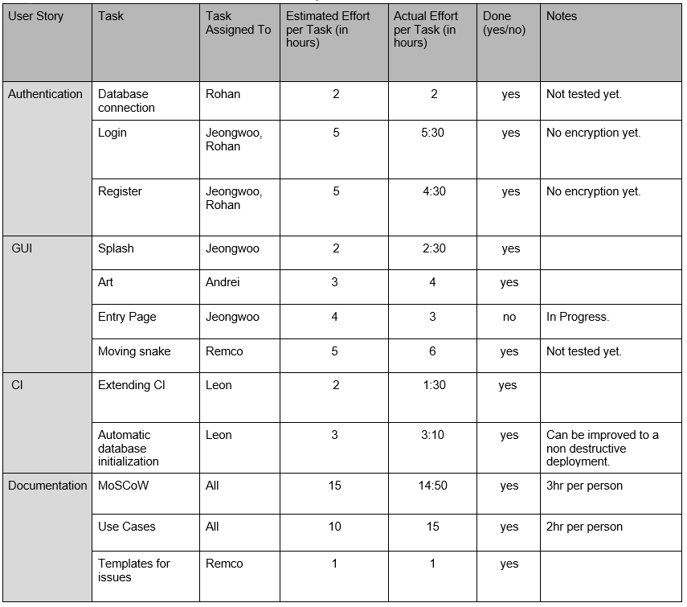

## Sprint retrospective, Iteration #1

Project: Snake

Group: 1

### Main problems encountered

**Problem 1:** Rohan and Jeongwoo confronted a problem when they tried to run an application with JavaFX. They tried to run it without manually downloading JavaFX library, but then they could not. They struggled for hours.

Reaction: They finally found a solution. They needed to run it with "Gradle run", not "run in Intellij.

**Problem 2:** We overestimated how much work we could get done in one sprint. We thought we could also do collisions with snake, walls and pellets, but we could not finish everything required to start working on that yet.

Reaction: We delayed it for the following sprint.

**Problem 3:** During the extension of the CI some JaCoCo problems were encountered. The part of JaCoCo that enforces a certain amount of coverage works independently from the part that generates the report. Example: excluding classes for the coverage percentage would work but the report would still show the classes as untested. This seems like a thing that is not yet possible to fix in JaCoCo.

Reaction: The report does not reflect the exclusions made for the coverage tool.

### Adjustments for the next Sprint Plan

- Finish the collisions mentioned in problem 2
- Write more tests
- Estimate times better
- Run static analysis tools more often, so that bugs are fixed earlier in the development process.
- Commit more often so changes to code are incremental and can be easily reverted.
