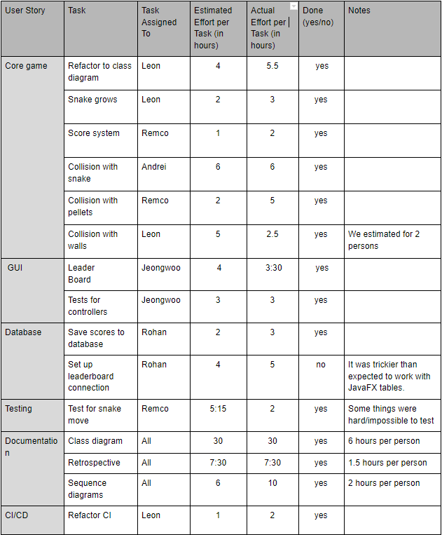

## Sprint retrospective, Iteration #2

Project: Snake

Group: 1

### What went well?
- Jeongwoo: Separating GUI logic from controller class was not easy at first for me because I did not have an idea how to do it. However, Leon helped me with it by showing some examples. I could then understand the problems and change the code accordingly. I guess this is a good example of team work.
- We finished all our issues without exceeding estimations by a lot. 
- We also used ‘Merge Request’ properly in GitLab this time. We have added comments to the points that need to be improved and resolved them before merge.

### What went less good?
- The refactoring of the game core didn’t go exactly as planned. Since our class diagram didn’t really fit well to our actual implementation. So some classes are slightly different from the diagram.
- Refactoring the CI was hard, but ended up being a really simple fix. 
- Working with JavaFX tables for the leaderboard was quite difficult and work on that should have started earlier in the sprint.
- Finished too close to the deadline.
- Using a development branch is not that useful. We merged everything to development with good descriptions in the merge requests. In the end we merged development 

### What can we do better next sprint?
- We need to make more diversity in weight (priority of work). ;-
- We need to complete everything and make sure that the pipeline passes and the commit for the assignment is tagged at least 30 minutes before the deadline. 

### What are actionable points for next sprint?
- We need to use not only 1 or 2 for the weight, but also 3.
- Have some buffer time before the deadline just in case something goes wrong or we have technical issues so we have time to fix them.
- Remove development branch. Directly merge with master through merge requests. 

### Review previous retrospective actionable point.
1) Finish the collisions of snake.
	- We managed to finish collisions.
2) Write more tests
	- Most of our working classes now have tests. The classes that we do not have tests are classes that are in progress or GUI (untestable).
3) Estimate times better
	- This has been done pretty well this time. Estimation and the actual time were mostly similar (no big differences like more than 2hrs).
4) Run static analysis tools more often, so that bugs are fixed earlier in the development process.
	- Definitely improved. Makes it easier when there is only a small number of problems. 
5) Commit more often so changes to code are incremental and can be easily reverted.
	- Definitely improved. 
