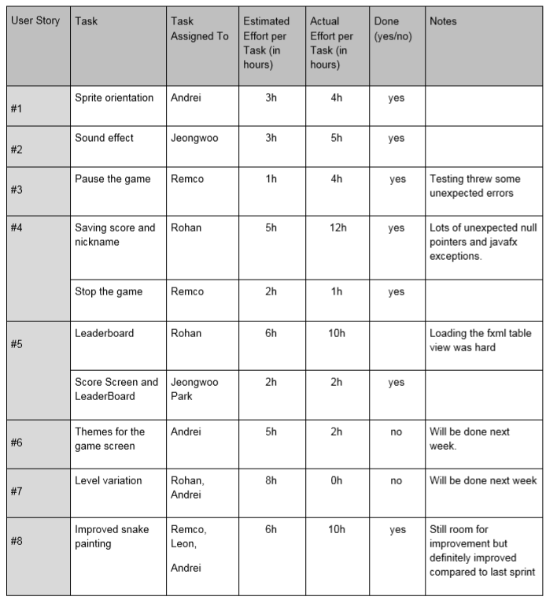
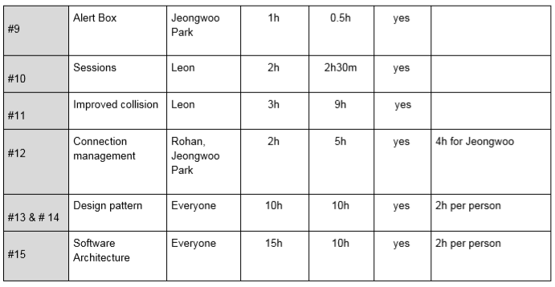

## Sprint retrospective, Iteration #3

Project: Snake

Group: 1

### User Stories
1) As a user, I want to be able to see the snake rotate when it moves in a different direction
2) As a user, I want to be able to hear a sound when the snake eats a pellet
3) As a user, I want to be able to pause the game and then resume it at a later time
4) As a user, I want to be able to save my score and nickname
5) As a user, I want to be able to see the leaderboard with all the top scores
6) As a user, I want to be able to be able to pick a different theme for the game
7) As a user, I want to be able to play different types of levels
8) As a user, I want to be able to see the snake being painted properly (no flicker)
9) As a user, I want to be able to differentiate the types of alerts I get such as warning and information.
10) As a user, I want to be able to log in just once and keep being logged in after that.
11) As a developer, I want to be able to verify whether a collision happened more efficiently
12) As a developer, I want to be able to connect to the database without it throwing errors
13) As a developer, I want to be able to have one single connection open at any given time
14) As a developer, I want to be able to be able to build different types of boards for the levels
15) As a developer, I want to be able to have a clear software architecture documentation.

### What went well?
- We managed to get the basic functionality of the game working (with the exception of level variations) and are working on improving small mistakes, refactoring and adding extras (such as themes, sounds and cookies for sessions).
- There is a noticeable improvement in overall GUI as well. Most of the GUI for the game is now done and it has buttons like go back and quit.

### What went less good?
- It has taken quite a long time to settle down on which design patterns to use. We first thought we could use Strategy since we already had an abstract “Tile” class and subclasses with different behaviours that were extending it, but we were not sure if we should use Strategy or Template because it seemed like either would be fine. Then we decided to use a Factory method for the Board because we wanted to have different types of boards for different levels, but we didn’t have most of the components of the Factory method, so we finally decided to use a Builder.
- The improved collision took way longer than expected. Got stuck multiple times on different parts of the implementation. As well as writing some of the tests for the collision manager. Some work also got nullified when we decided that the Builder pattern was actually better than a factory. This all took quite a lot of time, quite a lot more than expected.
- Some features were in two separate issues (e.g. user story #4). This caused us to work on the same thing, which is not necessarily bad. It is bad when we do not know it from each other.

### Review previous retrospective actionable point.
1) We need to use not only 1 or 2 for the weight, but also 3.
	- We started using 3 a lot more for issues that were lower priority.
2) Have some buffer time before the deadline just in case something goes wrong or we have technical issues so we have time to fix them.
	- Writing this one day before the sprint deadline. Still a lot needs to be done so we could still improve on this. 
3) Remove development branch. Directly merge with master through merge requests. 
	- We removed the Development branch and pushed directly to Master.
